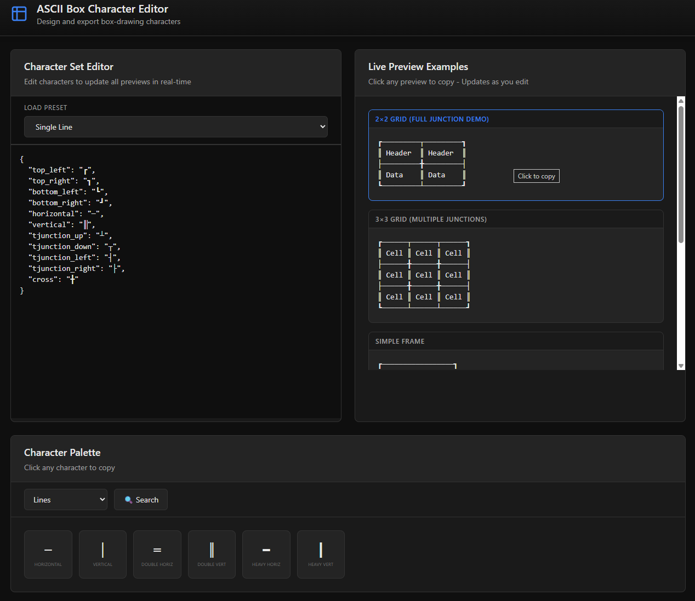

# ASCII Box Character Editor

A modern, professional web application for creating and previewing ASCII box-drawing characters with live rendering, interactive editor, character palette, and one-click copy functionality.


## Features

### Live Character Set Editor

- **Real-Time JSON Editor** - Edit character definitions and see instant updates
- **6 Built-in Presets** - Single Line, Double Line, Heavy Line, Rounded Corners, Mixed Double/Single, ASCII Basic
- **Instant Preview Updates** - All 5 preview patterns update as you type
- **JSON Validation** - Automatic parsing with graceful error handling

### Live Preview Examples

- **5 Demonstration Patterns** - Comprehensive box patterns showcasing all junction types:
  - 2×2 Grid (Full Junction Demo)
  - 3×3 Grid (Multiple Junctions)
  - Simple Frame
  - Single Cell
  - Wide Header Box
- **One-Click Copy** - Click any preview to copy the entire pattern
- **Dynamic Rendering** - Real-time updates based on editor changes

### Character Palette

- **4 Organized Categories** - Corners, Lines, T-Junctions, Crosses
- **60+ Characters** - Complete Unicode box-drawing character set
- **Visual Labels** - Each character displays with its descriptive name
- **Search Functionality** - Find characters by name with live filtering
- **Category Browsing** - Filter by character type for easy navigation
- **Instant Copy** - Click any character to copy to clipboard

### Modern UI Design

- Professional dark theme with subtle gradients
- Blue accent colors with clean borders
- Smooth hover effects and transitions
- Responsive grid layout
- Toast notifications for user feedback
- Keyboard shortcuts (?, Ctrl+F)

## Quick Start

```bash
# Preferred (UDL ecosystem)
pnpm install
pnpm dev
pnpm build
pnpm preview

# Or npm if pnpm is unavailable
npm install
npm run dev
npm run build
npm run preview
```

The application will be available at `http://localhost:5173`

## Usage

### Basic Workflow

1. **Load a Preset** - Select from 6 built-in character sets in the dropdown
2. **Edit Characters** - Modify the JSON in the left editor panel
3. **View Live Previews** - Watch 5 different box patterns update in real-time on the right
4. **Browse Character Palette** - Select a category to view available characters
5. **Copy & Paste** - Click characters to copy, paste into editor to customize
6. **Export Previews** - Click any preview box to copy the entire pattern



### Editor Format

The editor uses a simple JSON format:

```json
{
  "top_left": "┌",
  "top_right": "┐",
  "bottom_left": "└",
  "bottom_right": "┘",
  "horizontal": "─",
  "vertical": "│",
  "tjunction_up": "┴",
  "tjunction_down": "┬",
  "tjunction_left": "┤",
  "tjunction_right": "├",
  "cross": "┼"
}
```

### Keyboard Shortcuts

- `?` - Show keyboard shortcuts help
- `Ctrl+F` / `Cmd+F` - Open character search

## Available Presets

| Preset              | Description                        | Example |
| ------------------- | ---------------------------------- | ------- |
| Single Line         | Light single-line borders          | `┌─┐`   |
| Double Line         | Double-line borders                | `╔═╗`   |
| Heavy Line          | Bold thick borders                 | `┏━┓`   |
| Rounded Corners     | Smooth rounded corners             | `╭─╮`   |
| Mixed Double/Single | Double horizontal, single vertical | `╒═╕`   |
| ASCII Basic         | Classic +/-/\| style               | `+--+`  |

## Character Categories

| Category    | Count | Characters Included                             |
| ----------- | ----- | ----------------------------------------------- |
| Corners     | 16    | Light, double, heavy, and rounded corners       |
| Lines       | 6     | Horizontal and vertical lines in various styles |
| T-Junctions | 8     | All directional T-junction types                |
| Crosses     | 4     | Cross junction styles                           |

## Tech Stack

- **Framework**: React 18 with TypeScript
- **Build Tool**: Vite 5
- **Styling**: Tailwind CSS 3
- **Icons**: SVG inline graphics
- **Characters**: Unicode box-drawing set (U+2500–U+257F)

## Project Structure

```text
ascii-box-editor/
├── src/
│   ├── App.tsx           # Main application component
│   ├── presets.ts        # 6 character set definitions
│   ├── renderer.ts       # 5 pattern rendering functions
│   ├── main.tsx          # React entry point
│   └── index.css         # Global styles
├── index.html            # HTML template
├── package.json          # Dependencies and scripts
├── vite.config.ts        # Vite configuration
├── tailwind.config.js    # Tailwind CSS config
└── tsconfig.json         # TypeScript configuration
```

## Design System

### Color Palette

- Background: `#0f0f0f` (Deep black)
- Cards: `#1a1a1a` (Dark gray)
- Borders: `#333333` (Medium gray)
- Accent: `#3b82f6` (Blue)
- Success: `#22c55e` (Green)
- Text: `#e8e8e8` (Light gray)
- Muted: `#a0a0a0` (Medium gray)

### UI Components

- Split-panel layout with editor and preview
- Card-based character palette with grid
- Scrollable preview panel
- Fixed toast notifications
- Responsive breakpoints for mobile/tablet/desktop

## Browser Support

- Chrome 90+
- Firefox 88+
- Safari 14+
- Edge 90+

## Development

```bash
# Type checking
npm run typecheck

# Linting
npm run lint

# Build production bundle
npm run build
```

## Python Backend (Legacy)

A Flask backend version is also available in the project:

```bash
# Install Python dependencies
pip install -r requirements.txt

# Run Flask server
python3 app.py

# Access at http://localhost:5000
```

See `README_FLASK.md` for Flask-specific documentation.

## License

MIT License - Free to use, modify, and distribute

## Version History

### Current (React Version)

- Complete React + TypeScript rewrite
- Real-time editor with instant preview updates
- Simplified character palette with 4 main categories
- Modern Tailwind CSS styling
- Vite build system for fast development
- Fully client-side rendering

### v2.1 (Flask)

- Character search functionality
- Keyboard shortcuts
- Editor controls
- Enhanced UI/UX

### v2.0 (Flask)

- Character palette with 8 categories
- Monaco editor integration
- Modern dark theme
- Copy functionality

### v1.0 (Flask)

- Initial Flask release
- 6 presets
- Basic live preview
